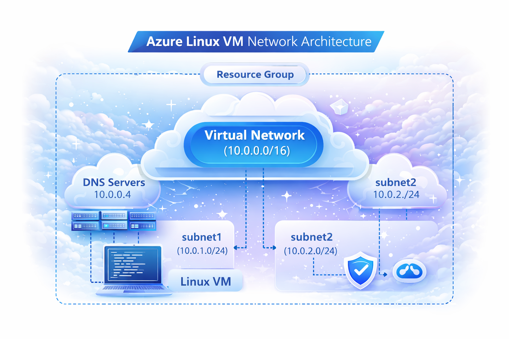

  

# azure-vm

This project deploys a Linux VM network architecture in Azure using Terraform.

- Resource Group
- Virtual Network (10.0.0.0/16)
- Two Subnets
- Linux VM
- Designed for scalability and security

- Terraform
- Microsoft Azure
- Linux

#   Anson Inomwan
